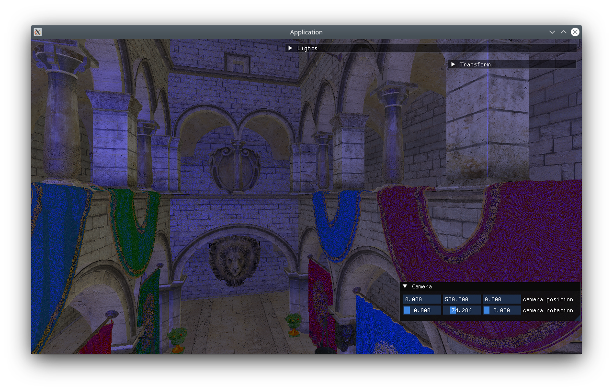

# GLoom - OpenGL library

## About 

GLoom is a small utility library for OpenGL designed to support the development of more complex applications. It includes wrappers for OpenGL objects, a mesh loader, a simple scene, and a renderer.

### Examples:

### Third Party 

1. [Dear ImGui](https://github.com/ocornut/imgui) for UI
1. [tinyobjloader](https://github.com/tinyobjloader/tinyobjloader) for OBJ files loading
2. [Assimp](https://github.com/assimp/assimp) for other model formats
3. [STB](https://github.com/nothings/stb) for image processing
4. [GLM](https://github.com/g-truc/glm) for 3D mathematics 

### Gratitudes

1. [The Cherno](https://www.youtube.com/@TheCherno)
2. [Learn OpenGL](https://learnopengl.com/)

